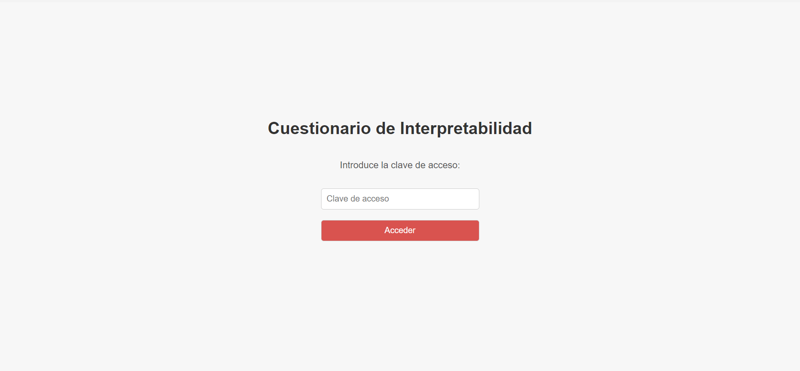
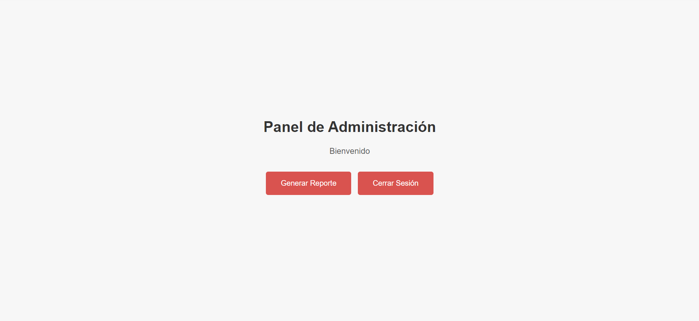
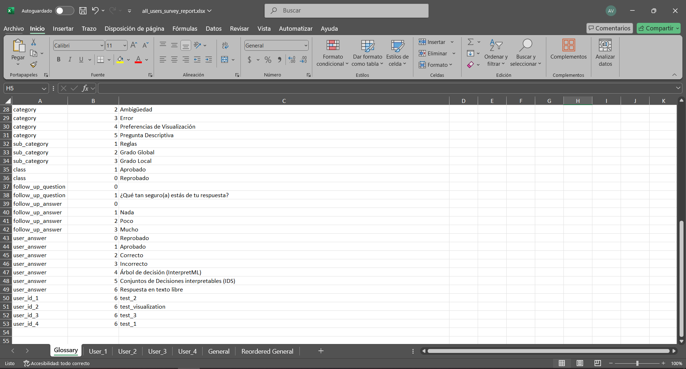
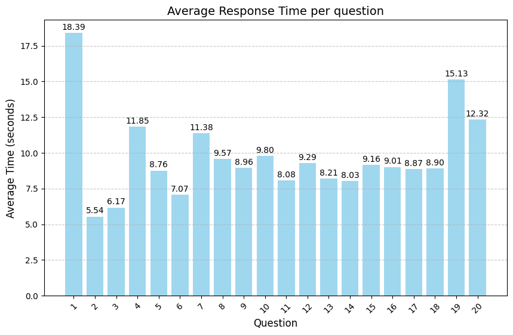
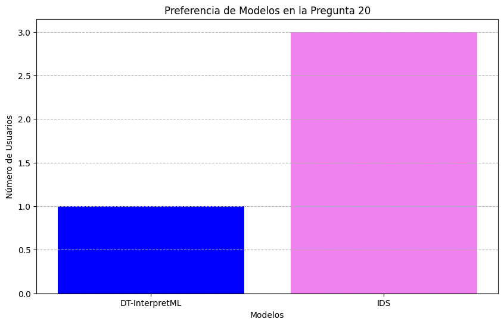

# Survey-XAI-App

Survey-XAI-App es una herramienta desarrollada por Adrián Vargas Rangel para el Trabajo de Fin de Máster (TFM) de Inteligencia Artificial *"A Tool for Human Evaluation of Interpretability"*, en la Universidad Politécnica de Madrid (2024). Su propósito es analizar y comparar la interpretabilidad y precisión de modelos transparentes en aprendizaje automático, específicamente Árboles de Decisión (DT) e Interpretable Decision Sets (IDS).

## Contexto

La interpretabilidad en inteligencia artificial es fundamental, especialmente en áreas donde las decisiones automáticas tienen impactos significativos. Este TFM aborda estas cuestiones en un escenario educativo, utilizando modelos transparentes para analizar el rendimiento académico de estudiantes en matemáticas.

Survey-XAI-App integra una aplicación web que recopila datos a través de un cuestionario interactivo. Estos datos permiten combinar métricas técnicas (parsimonia, cobertura, simplicidad de reglas) con la percepción humana de interpretabilidad, proporcionando información sobre cómo los usuarios finales comprenden las decisiones de los modelos.

## Implementación de Modelos
La implementación de los modelos evaluados está documentada en el notebook Survey-XAI-Models.ipynb, ubicado en la carpeta notebook. Además de validar el rendimiento de los modelos, este archivo también detalla el preprocesamiento, entrenamiento y generación de reglas, y sirve como referencia técnica para reproducir el estudio. También contiene los csv generados con las métricas de interpretabilidad cuantitativas de las reglas generadas por los modelos: precisión, parsimonía, cobertura, gini y sparsidad.

### Uso de Árboles de Decisión (DT) de InterpretML
Se utilizó el Árbol de Decisión (DT) de la biblioteca [InterpretML](https://interpret.ml/) debido a su enfoque en la interpretabilidad intrínseca y su capacidad para generar explicaciones locales y globales fácilmente comprensibles:

- **Compatibilidad con explicaciones visuales**: Proporciona visualizaciones claras, como diagramas de árbol y gráficas de importancia de características, lo que facilita su integración en el cuestionario.
- **Optimización para interpretabilidad**: Prioriza métricas como la parsimonía y simplicidad en la construcción del árbol.
- **Consistencia con IDS**: Permite una comparación directa con los modelos IDS al generar reglas con una estructura interpretativa similar.

InterpretML ofrece una implementación optimizada basada en scikit-learn. En este trabajo se usó dicho modelo subyacente de scikit-learn para detallar algunos de los atributos de los grafos generados.

## Herramientas Desarrolladas

### 1. **Librería IDS Personalizada**
Una implementación adaptada de Interpretable Decision Sets (IDS) basada en el repositorio [pyIDS](https://github.com/jirifilip/pyIDS) y el estudio de Lakkaraju et al. (2016). Una copia de la librería desarrollada se encuentra en la carpeta IDS de este proyecto y permite:
- Generación de reglas interpretables optimizadas.
- Preprocesamiento y balanceo de datos con SMOTE.
- Ajuste de parámetros como soporte, confianza y longitud máxima de reglas.
Disponible aquí: [IDS - Interpretable Decision Sets](https://github.com/adrian-vargas/IDS).

### 2. **Survey-XAI-App**
Aplicación web para evaluar interpretabilidad:
- Usa las reglas generadas por modelos DT-InterpretML e IDS.
- Mide tiempos de respuesta y evalúa comprensión de reglas.
- Genera reportes en Excel y gráficos detallados.

## Cuestionario Implementado

El cuestionario interactivo de la aplicación evalúa la interpretabilidad de los modelos utilizando 21 preguntas diseñadas cuidadosamente para abordar diversos aspectos. Estas preguntas están organizadas en las siguientes categorías:

1. **Exactitud**: Evalúa si los usuarios pueden identificar correctamente la predicción del modelo basándose en las reglas presentadas.  
   - Subcategorías:
     - **Reglas**: Predicciones basadas en reglas específicas del modelo.
     - **Grado Global**: Predicciones basadas en la estructura global del modelo.
     - **Grado Local**: Predicciones basadas en un grafo local generado por el modelo.

2. **Ambigüedad**: Explora cómo los usuarios perciben predicciones ambiguas y mide la confianza en sus respuestas.  
   - Subcategorías:
     - **Reglas**: Ambigüedad en reglas específicas.
     - **Grado Global y Local**: Ambigüedad en la estructura global y local.

3. **Errores**: Preguntas diseñadas para evaluar si los usuarios identifican correctamente errores en las predicciones del modelo.  
   - Subcategorías:
     - **Reglas**: Errores en reglas específicas.
     - **Grado Global y Local**: Errores en la estructura global y local.

4. **Preferencias de Visualización**: Preguntas abiertas donde los usuarios seleccionan qué visualización encuentran más útil para comprender el modelo y analizar errores.

5. **Pregunta Descriptiva**: Una pregunta final abierta que permite a los usuarios expresar su opinión sobre el uso de visualizaciones y reglas para acompañar las predicciones.

Las visualizaciones utilizadas en las preguntas, como los grafos locales y globales, se generan a partir de los modelos DT-InterpretML e IDS. Es importante destacar que las subcategorías comparten la misma pregunta formulada, pero esta se aplica de forma independiente a ambos modelos, utilizando sus respectivas visualizaciones y reglas.

### Ejemplo de Configuración de Preguntas

Las preguntas se gestionan a través del archivo `questions.json`, que contiene información estructurada como la siguiente:

```json
{
    "id": 1,
    "category": "Exactitud",
    "sub_category": "Reglas",
    "instructions": "Selecciona la predicción de acuerdo con la observación",
    "model": "DT-InterpretML",
    "observation": {
        "absences": 0,
        "goout": 2,
        "studytime": 3,
        "reason_reputation": 1,
        "failures": 0,
        "Fedu": 3
    },
    "rules": [
        "si failures ≤ 0.50 y reason_reputation ≤ 0.50 y Fedu ≤ 1.50 entonces Reprobado",
        "si failures ≤ 0.50 y reason_reputation > 0.50 y absences ≤ 13.50 entonces Aprobado"
    ],
    "prediction_model": {
        "DT-InterpretML": "Aprobado",
        "IDS": "Aprobado"
    },
    "real_class": "Aprobado",
    "answer": null
}
```

Este archivo permite agregar o modificar preguntas sin necesidad de cambiar el código principal de la aplicación.

### Características Medidas

- **Confianza del usuario**: Preguntas de seguimiento para evaluar el nivel de certeza de los participantes.
- **Errores detectados**: Identificación de predicciones incorrectas de los modelos.
- **Preferencias de visualización**: Evaluación subjetiva sobre qué modelo facilita más el análisis y la comprensión.

## Dataset Utilizado

El conjunto de datos utilizado en este proyecto es el **Student Performance**, recopilado por Paulo Cortez y disponible en el [UCI Machine Learning Repository](https://archive.ics.uci.edu/dataset/320/student+performance). Este dataset incluye características relevantes relacionadas con el rendimiento académico de los estudiantes, utilizadas para construir modelos predictivos que clasifican a los estudiantes en dos categorías: **Aprobado** o **Reprobado**.

### Variables del Dataset

| **Característica**   | **Descripción**                                              | **Posibles Valores**                                                                       |
|-----------------------|------------------------------------------------------------|-------------------------------------------------------------------------------------------|
| `absences`           | Número de ausencias escolares del estudiante.              | Valores numéricos de 0 a 93                                                               |
| `goout`              | Frecuencia con la que el estudiante sale con amigos.        | Enteros de 1 a 5: <br> 1: Muy baja frecuencia <br> 5: Muy alta frecuencia                 |
| `studytime`          | Tiempo semanal dedicado al estudio fuera de las clases.     | Enteros de 1 a 4: <br> 1: Menos de 2 horas <br> 2: Entre 2 y 5 horas <br> 3: Entre 5 y 10 horas <br> 4: Más de 10 horas |
| `reason_reputation`  | Razón principal para elegir la escuela (reputación).        | Binario: <br> 0: No es la razón principal <br> 1: Es la razón principal                   |
| `failures`           | Número de asignaturas reprobadas anteriormente.             | Enteros de 0 a 4: <br> 0: Ninguna asignatura <br> 4: Cuatro o más asignaturas reprobadas  |
| `Fedu`               | Nivel educativo del padre.                                  | Enteros de 0 a 4: <br> 0: Sin educación <br> 1: Primaria <br> 2: Secundaria <br> 3: Universidad <br> 4: Postgrado o avanzado |

Estas características fueron seleccionadas por su relevancia para predecir el rendimiento académico de los estudiantes. El conjunto de datos fue preprocesado para balancear las clases (aprobado/reprobado) utilizando técnicas como SMOTE. Posteriormente, estas variables se utilizaron para entrenar y evaluar modelos interpretables, específicamente Árboles de Decisión (DT) de [InterpretML](https://interpret.ml/) e Interpretable Decision Sets (IDS). Los modelos generaron reglas y visualizaciones que fueron integradas en el cuestionario de esta aplicación.

## Visualización y Resultados

### Interfaz Principal
La aplicación ofrece una interfaz intuitiva para usuarios y administradores:





### Reportes Generados
Los reportes incluyen:
- Glosario del análisis.
- Análisis individual y general de las respuestas.

Ejemplo de glosario:


Gráfico de tiempo promedio por pregunta:


Análisis de preferencias de modelos:


## Instalación

1. **Clonar el Repositorio**
```bash
git clone https://github.com/adrian-vargas/survey-xai-app.git
cd survey-xai-app
```

2. **Configurar Entorno Virtual**
```bash
python -m venv venv
source venv/bin/activate  # Linux/Mac
venv\Scripts\activate   # Windows
```

3. **Instalar Dependencias**
```bash
pip install -r requirements.txt
```

4. **Configurar Variables de Entorno**
Crear un archivo `.env`:
```
MONGO_URI=mongodb+srv://<usuario>:<contraseña>@cluster.mongodb.net/<db_name>
MONGO_DB_NAME=nombre_de_la_base
MONGO_COLLECTION_NAME=nombre_de_la_colección
SECRET_KEY=clave_secreta_flask
PORT=5000
```

5. **Ejecutar la Aplicación**
```bash
cd survey-xai-app
python app.py
```

Accede en: [http://localhost:5000](http://localhost:5000).

## Licencia

Este proyecto está bajo la [Licencia MIT](LICENSE).
