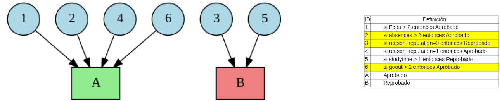

# IDS - Interpretable Decision Sets

IDS es una librería en Python diseñada para entrenar modelos de Interpretable Decision Sets (IDS), un marco de modelos de inteligencia artificial transparente que genera conjuntos de reglas fácilmente interpretables. Estos modelos son ideales para aplicaciones donde la transparencia y la interpretabilidad son críticas.

Este proyecto es parte del Trabajo de Fin de Máster (TFM) *A Tool for Human Evaluation of Interpretability* realizado por Adrián Vargas en la Universidad Politécnica de Madrid. La librería IDS implementa y extiende ideas clave del estudio de [Lakkaraju et al. (2016)](https://cs.stanford.edu/people/jure/pubs/interpretable-kdd16.pdf) y el repositorio original [pyIDS](https://github.com/jirifilip/pyIDS), optimizando tanto la precisión como la interpretabilidad.

## Características Técnicas

- **Generación de reglas interpretables**: Utiliza Apriori para crear reglas basadas en soporte y confianza.
- **Optimización mediante programación lineal**: Garantiza un equilibrio entre precisión y simplicidad de las reglas.
- **Análisis de interpretabilidad**: Calcula métricas como sparsity, coverage, gini y parsimony.
- **Visualización avanzada**: Incluye gráficos globales y explicaciones locales mediante Graphviz y Matplotlib.
- **Balanceo de datos**: Compatibilidad con SMOTE para mejorar la distribución de clases.

## Visualización de Reglas

La librería IDS permite generar explicaciones visuales de las reglas globales y locales. A continuación, se muestran ejemplos de ambas:

### Grafo Global


### Grafo Local


## Estructura del Proyecto

```
IDS/
│
├── ids/                       # Código principal de la librería
│   ├── models/                # Definición de modelos y clases relacionadas
│   │   ├── __init__.py
│   │   └── rule.py            # Implementación de la clase Rule
│   ├── __init__.py
│   ├── ids.py                 # Implementación del modelo IDS
│   ├── metrics.py             # Cálculo de métricas de interpretabilidad
│   └── utils.py               # Funciones auxiliares para generación y visualización de reglas
├── img/                       # Carpeta de imágenes de grafos
│   ├── ambiguedad.png         # Ejemplo de grafo global
│   └── ambiguedad copy.png    # Ejemplo de grafo local
├── venv/                      # Entorno virtual (opcional)
├── .gitignore
├── LICENSE
├── README.md                  # Documentación del proyecto
├── requirements.txt           # Dependencias del proyecto
└── setup.py                   # Archivo de configuración para la instalación
```

## Instalación

Para instalar la librería, clona el repositorio y utiliza `pip` para instalar las dependencias:

```bash
git clone https://github.com/adrian-vargas/IDS.git
cd IDS
pip install -r requirements.txt
```

Asegúrate de tener Python 3.12.5 o superior.

## Ejemplo de Uso

### 1. Importación y Configuración del Modelo IDS

```python
from ids import IDSModel
from ids.utils import generate_candidate_rules, print_and_save_rules
```

### 2. Entrenamiento del Modelo IDS

Para entrenar el modelo IDS, inicializa el modelo con los hiperparámetros adecuados según los objetivos de tu análisis. Puedes personalizar los siguientes hiperparámetros:

- **`lambda1`**: Penalización para el número de reglas. Aumenta este valor para generar menos reglas.  
  **Rango típico**: [0.01, 1.0].

- **`lambda2`**: Penalización para la longitud de las reglas. Valores más altos favorecen reglas más cortas y simples.  
  **Rango típico**: [0.01, 1.0].

- **`lambda3`**: Penalización para errores de clasificación. Incrementa este valor para priorizar la precisión del modelo.  
  **Rango típico**: [0.1, 10.0].

- **`lambda4`**: Penalización para el solapamiento entre reglas. Aumenta este valor para reducir solapamientos y generar reglas más distintas entre sí.  
  **Rango típico**: [0.1, 10.0].

- **`min_support`**: Soporte mínimo requerido para generar reglas. Valores más altos consideran solo patrones más frecuentes en los datos.  
  **Rango típico**: [0.01, 0.1].

- **`min_confidence`**: Confianza mínima para aceptar reglas. Aumenta este valor para generar reglas más fiables.  
  **Rango típico**: [0.5, 1.0].

- **`max_rule_length`**: Longitud máxima permitida para las reglas (número de condiciones). Reduce este valor para reglas más simples y comprensibles.  
  **Rango típico**: [1, 5].

#### Ejemplo de Configuración de Hiperparámetros

```python
from ids import IDSModel

# Inicializar el modelo IDS con hiperparámetros personalizados
model = IDSModel(
    lambda1=0.1,       # Penalización para el número de reglas
    lambda2=0.1,       # Penalización para la longitud de las reglas
    lambda3=1.0,       # Penalización para errores de clasificación
    lambda4=1.0,       # Penalización para solapamiento entre reglas
    min_support=0.05,  # Soporte mínimo para las reglas
    min_confidence=0.6, # Confianza mínima para aceptar reglas
    max_rule_length=3   # Longitud máxima de las reglas
)

# Entrenar el modelo IDS con datos de entrenamiento
model.fit(X_train, y_train)
```

### 3. Visualización de Reglas

```python
# Imprimir y guardar las reglas seleccionadas
rules_df = print_and_save_rules(ids_model, X_train, y_train, output_file="ids_rules.csv")

# Visualizar las reglas globalmente
from ids.utils import visualize_ids_rules
visualize_ids_rules(rules_df)
```

## Contribuciones

La librería **IDS** es una alternativa adecuada para proyectos de inteligencia artificial explicable (XAI):

1. **Entornos sensibles a la interpretabilidad**  
   Diseñada para casos como educación o finanzas, donde se requiere que los usuarios comprendan y confíen en las decisiones del modelo. Ejemplo: clasificar el rendimiento académico.

2. **Proyectos de investigación en XAI**  
   IDS es una alternativa menos compleja y más eficiente que **Smooth Local Search (SLS)**, gracias a:
   - **Programación lineal optimizada**: Selección de reglas mediante el solver PuLP para evitar redundancias y simplificar la búsqueda.
   - **Menor consumo computacional**: Ideal para sistemas con recursos limitados o datasets moderados.
   - **Flexibilidad**: Configuraciones avanzadas para soporte, confianza y longitud máxima de reglas.

3. **Visualización integrada y explicaciones claras**  
   Con herramientas como Graphviz y Matplotlib, IDS permite generar explicaciones locales y globales de manera intuitiva, facilitando el análisis de reglas.

4. **Integración sencilla con `scikit-learn`**  
   Su arquitectura modular la hace fácilmente integrable en pipelines de aprendizaje automático existentes, permitiendo personalizaciones según el contexto del proyecto.

## Licencia

Este proyecto está licenciado bajo la licencia MIT. Consulta el archivo `LICENSE` para más detalles.
